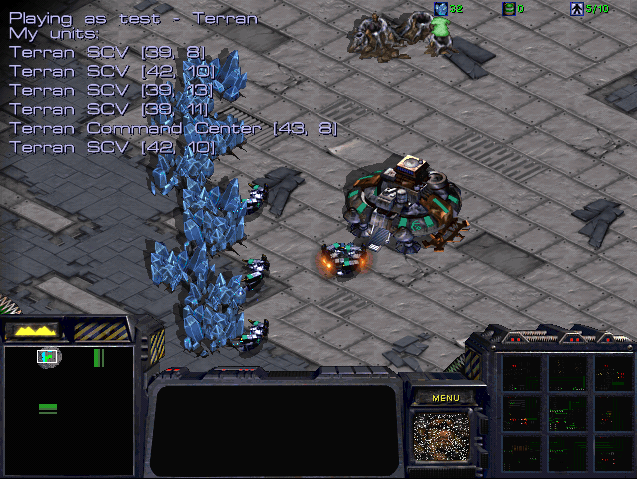

# Developer Guide

This page is a slightly modified version of the 
[SSCAI's BWAPI + BWMirror Tutorial (Java)](http://www.sscaitournament.com/index.php?action=tutorial), where instructions have been updated to match this project's filenames, paths and settings.

## Overview

This guide will teach you the basics of StarCraft bot programming in JAVA with BWMirror. BWMirror API is a Java wrapper for C++ BWAPI. It wraps all the classes, constants and enums inside Java objects, while providing the exact same interface as the original C++ BWAPI. This is achieved by heavily utilising JNI.
Please have the BWMirror Documentation opened at all times and refer to it frequently.

## Initial Setup

- Install StarCraft: Brood War, and update it to version 1.16.1. if necessary.
- Download SSCAI map pack and extract the included 'sscai' directory into your Starcraft/maps/ folder.
- Get 32bit JRE (Java Runtime Environment) if you don't have it already. Unfortunately, 64bit will not work at this moment.
- Download and extract Eclipse IDE if you don't have it already. If you do, just make sure it can use 32bit JRE to run the projects.
- Download and extract BWAPI.
- Run install.exe to install BWAPI.

    If you get the 'install.exe is not a valid Win32 application' error, you need to install BWAPI manually. In that case, follow these steps:

    1. Go to "BWAPI_3.7.4" folder. You will find 3 important directories there: "WINDOWS", "Starcraft" and "Chaoslauncher"
    - Copy all the files from the "WINDOWS" directory into your Windows installation location (e.g. C:\Windows\) or to any other location from your system's PATH variable.
        - Copy everything from "Starcraft" folder into the location of your StarCraft installation.
        - Create a desktop shortcut to the "Chaoslauncher\Chaoslauncher.exe" file and run it.
        - Sometimes, you might be asked to specify the path to your Starcraft.exe in ChaosLauncher's settings. In that case click the "Settings" tab set it in the "InstallPath" field. Click "OK" and "Ja" and ChaosLauncher will restart.
    - If the Chaoslauncher isn't already running, run it using the Desktop shortcut. We'll always use Chaoslauncher to run StarCraft with BWAPI.
    - In Chaoslauncher's 'Plugins' tab, enable 'BWAPI Injector (1.16.1.) RELEASE' and (optionally) 'W-MODE 1.02'.
    Download Example Bot - Eclipse and extract it wherever you want to work on it.
    Run your bot using 32-bit JRE.

## Importing the Bot to Eclipse

Run eclipse.exe. File → Import → General → Existing Projects into Workspace → Browse... → Locate ExampleBot folder.
The ExampleBot project should appear in the ```Projects:``` field. Make sure it's selected and click Finish.
In Package Explorer (left side of Eclipse IDE) navigate to src → (default package) → TestBot1.java and double-click it. This is your bot's source code.

## Event Listeners and the API

    - In the source code, you'll find the onFrame() method. That's the implementation of the event listener that's called once on every logical game frame (that's 23.81x per second on Fastest game speed setting).
    - There is also the onStart() listener implementation that's called only once, when the game starts.
    - Most of the simple bots only use these two listeners.
    - However, your bot's code can also be hooked to other event listeners and get executed after various other game events. To do that, you can either implement the interface directly, or extend the stub class DefaultBWListener.
    - For event listeners to work, the API object Mirror needs to be created (take a look at the declaration 'private Mirror mirror = new Mirror();' in the code) and it needs to have the listener registered (done by 'mirror.getModule().setEventListener(...)').

## Running the Bot

    - Run the bot from Run menu (or press Ctrl+F11).
    - It should execute the main() method that calls run() function, which registers the listeners and starts waiting for the game by calling mirror.startGame().
    - In the console (bottom of the Eclipse IDE), you should see the 'Connecting to Broodwar...' message. The bot is now waiting for the game to start.
    - Run the game from Chaoslauncher (Start button).
    - In the game, run some Custom Melee game. For example: Single Player → Expansion → select/create some player → Play Custom → Set game type to Melee → Select some map and specify player races → OK
    HIGHLY RECOMMENDED: You should definitely set up your bwapi.ini file (in Starcraft/bwapi-data/ folder) to automate this process! Open it and set the following values:
    
    ```
        auto_menu = SINGLE_PLAYER
        maps = maps\sscai\*.sc?
        Set race and enemy_race to whatever race you want your bot and enemy to be. You should NOT use Random.
    ```

    - When the game ends, don't forget to terminate the running bot. Press the red square button in the Console section of the screen (or set up your own keyboard shortcut).



This is what the running ExampleBot looks like. If you don't see the debug text, or the workers aren't gathering minerals, the bot is probably not running, or cannot connect to the game.


## User Input and Speed

You can add the following commands to onStart() method to make the debugging easier:

    game.enableFlag(1); - This command allows you to manually control the units during the game.
    game.setLocalSpeed(value); - This changes the game speed to a given (integer) value. Maximum possible speed corresponds to 0, while typical game speed is around 30. SSCAI tournament is played on speed 20.

Note: You can also change game speed manually during the game. Just type in '/speed 0' (or other value) into in-game chat (press Enter to start typing).
Note: In-game chat can also be used to type in the cheat codes that can help in the debugging process. You can get your bot to type in cheats (or any other messages) by calling the sendText() method. For example: game.sendText("show me the money");

## Implementation and Important Classes

### Game Class

The Game object, received by calling Mirror.getGame(), gives you access to players, units as well as general information about the current game. It also provides you with the ability to print draw text or simple geometry on the game screen/map. This greatly helps with debugging your bot. See the collection of methods: ```draw_\__Screen``` to draw using screen coordinates (0,0 is top left corner of the screen) and ```draw_\__Map``` if you wish to use map coordinates (0,0 is top left corner of the map)

### Player Class

Player object mainly gives you access to your units and resources. The following lines of code print some debug information about the Player on the screen. 2nd line is already in the ExampleBot's code - it prints player's name and race on screen coordinates (10,10). 3rd line would print current player's resources on screen coordinates (10,230). Try adding it.

```
Player self = game.self();
game.drawTextScreen(10, 10, "Playing as " + self.getName() + " - " + self.getRace());
game.drawTextScreen(10, 230, "Resources: " + self.minerals() + " minerals,  " + self.gas() + " gas");
```

Note (supply): Since zerglings take 0.5 supply, the supply values in the API are doubled compared to what you would expect. Thus if self.supplyTotal() - self.supplyUsed() == 2, we can only build one Marine. Try modifying the code to display current supply values in the same manner as the game interface does (see the top-right corner during the game).

## Unit Class and Orders

BWMirror API represents almost all in game objects as units. This means not only Zerglings and Overlords count, but buildings such as Barracks, thier addons or even Mineral Fields are units.
To access your units, just call Player.units(). The same works for enemy units - just call Game.enemy.getUnits() (of course, this returns only currently visible enemy units). To give a unit an order, simply call the appropriate method - for example:

- **rightClick(...):** Does the same thing, as if we had this unit selected, and right-clicked on something in the game.
- **move(...):** Moves the unit, if it can move.
- **build(...):** If our unit is a worker, this is used to construct new buildings.
- **gather(...):** Sends our unit to gather resources (minerals or gas).
- **attack(...):** Makes our unit attack an enemy units.
- **train(...):** Trains new units - this order is usually issued to buildings.
- **upgrade(...):** Starts the upgrade in our building (e.g. damage or armor).
- **research(...):** Starts researching a specified technology/ability in our building (e.g. Stimpacks or Parasite).
- **etc.**

```
for (Unit myUnit : self.getUnits()) {
    //issue orders. For example:
    //myUnit.attack(somePosition);
}
```


However, you usually want to give units specific orders depending on their type. This brings us to ...

### UnitType Class

UnitType gives you a lot of additional information about the unit, such as its max health, cost, weapon type, or even build time. To get unit's type, use unit.getType(). BWMirror API comes with predefined constants for all unit types, you can find them as public static class fields in UnitType class. To test, whether a unit is of a particular type, you can simply compare it's type with one of the predefined constants:

```
if (myUnit.getType() == UnitType.Terran_Command_Center && self.minerals() >= 50) {
	myUnit.train(UnitType.Terran_SCV);
}
```
            

With this, we can iterate over all our units and assign different orders to them. For example, the following code makes all our Command Centers train new workers and all our Marines attack top-left corner of the map:

```
//iterate over my units
for (Unit myUnit : self.getUnits()) {

	//if this is Command Center, make it train additional worker
	if (myUnit.getType() == UnitType.Terran_Command_Center) {
		myUnit.train(UnitType.Terran_SCV);
	}
                    
	//if this is marine, let it attack some position
	if (myUnit.getType() == UnitType.Terran_Marine) {
		myUnit.attack(new Position(0, 0));
	}
                    
}
```
            

By now you understand that some of the orders (such as attacking or constructing new buildings) take some kind of location specification as the argument. Let's take a closer look at this.

### Positioning

BWMirror API and StarCraft game itself uses two basic position concepts:

    - **Position Class** - represents pixel precise position in the game. Use unit.getPosition() to get the current position of some unit.
    - **TilePosition Class** - represents tile position in game. A tile is a 32x32 pixels square, used primarily for building placement. Use unit.getTilePosition() to access this one.

Take a look at the following code. It prints the TilePosition and Position of all our workers right next to them. First two arguments specify where in the map this should be printed with pixel precision (Position.getX() and Position.getY()). Try experimenting with this code yourself.

```
//iterate over my units
for (Unit myUnit : self.getUnits()) {

	//print TilePosition and Position of my SCVs
	if (myUnit.getType() == UnitType.Terran_SCV) {
		game.drawTextMap(myUnit.getPosition().getX(), myUnit.getPosition().getY(), 
			"TilePos: "+myUnit.getTilePosition().toString()+" Pos: "+myUnit.getPosition().toString());
	}
                 
}
```
            

In a similar manner, try to print out the current order assigned to every unit or even draw the line to their destinations. This might be very useful later.

```
game.drawTextMap(myUnit.getPosition().getX(), myUnit.getPosition().getY(), myUnit.getOrder().toString());
game.drawLineMap(myUnit.getPosition().getX(), myUnit.getPosition().getY(), myUnit.getOrderTargetPosition().getX(), 
		myUnit.getOrderTargetPosition().getY(), bwapi.Color.Black);
```

Note: Remember that the top-left tile, or the top-left pixel of the map have the coordinates (0,0).

## Map Information and Constructing Buildings

You can use the Game class, to get basic information such as map size, or testing whether a particular tile is buildable or walkable. If you want more complex things, such as getting the locations of all bases, we recommend using BWTA (see next section).

The Game class should be sufficient for simple building construction. For example, let's take a look at how you can order your workers to build a Supply Depot:

```
//if we're running out of supply and have enough minerals ...
if ((self.supplyTotal() - self.supplyUsed() < 2) && (self.minerals() >= 100)) {
	//iterate over units to find a worker
	for (Unit myUnit : self.getUnits()) {
		if (myUnit.getType() == UnitType.Terran_SCV) {
			//get a nice place to build a supply depot 
			TilePosition buildTile = 
				getBuildTile(myUnit, UnitType.Terran_Supply_Depot, self.getStartLocation());
			//and, if found, send the worker to build it (and leave others alone - break;)
			if (buildTile != null) {
				myUnit.build(buildTile, UnitType.Terran_Supply_Depot);
				break;
			}
		}
	}
}
```
            

This piece of code gets activated when we're running out of free supply and have enough minerals for the depot. It finds a worker, finds a TilePosition near our start location where we can build a Supply Depot and orders the worker to do it. However, the getBuildTile() function is not part of the BWMirror API and, in general, you need to implement it yourself (sample implementation is below).

Good building placement for real-time strategy games is actually a complex problem and bot programmers can employ a variety of advanced methods to solve it. However, as a beginner, feel free to use this simple, inefficient, search-based implementation:

```
// Returns a suitable TilePosition to build a given building type near 
// specified TilePosition aroundTile, or null if not found. (builder parameter is our worker)
public TilePosition getBuildTile(Unit builder, UnitType buildingType, TilePosition aroundTile) {
	TilePosition ret = null;
	int maxDist = 3;
	int stopDist = 40;
	
	// Refinery, Assimilator, Extractor
	if (buildingType.isRefinery()) {
		for (Unit n : game.neutral().getUnits()) {
			if ((n.getType() == UnitType.Resource_Vespene_Geyser) && 
					( Math.abs(n.getTilePosition().getX() - aroundTile.getX()) < stopDist ) &&
					( Math.abs(n.getTilePosition().getY() - aroundTile.getY()) < stopDist )
					) return n.getTilePosition();
		}
	}
	
	while ((maxDist < stopDist) && (ret == null)) {
		for (int i=aroundTile.getX()-maxDist; i<=aroundTile.getX()+maxDist; i++) {
			for (int j=aroundTile.getY()-maxDist; j<=aroundTile.getY()+maxDist; j++) {
				if (game.canBuildHere(builder, new TilePosition(i,j), buildingType, false)) {
					// units that are blocking the tile
					boolean unitsInWay = false;
					for (Unit u : game.getAllUnits()) {
						if (u.getID() == builder.getID()) continue;
						if ((Math.abs(u.getTilePosition().getX()-i) < 4) && (Math.abs(u.getTilePosition().getY()-j) < 4)) unitsInWay = true;
					}
					if (!unitsInWay) {
						return new TilePosition(i, j);
					}
					// creep for Zerg
					if (buildingType.requiresCreep()) {
						boolean creepMissing = false;
						for (int k=i; k<=i+buildingType.tileWidth(); k++) {
							for (int l=j; l<=j+buildingType.tileHeight(); l++) {
								if (!game.hasCreep(k, l)) creepMissing = true;
								break;
							}
						}
						if (creepMissing) continue; 
					}
				}
			}
		}
		maxDist += 2;
	}
	
	if (ret == null) game.printf("Unable to find suitable build position for "+buildingType.toString());
	return ret;
}
```
	

This function simply searches increasingly large area (while loop) around aroundTile for TilePositions where game.cenBuildHere() returns True. The search starts on 3-tile area and fails (returns null) if no solution is found within 40-tile area around aroundTile. It also skips those tiles, that are blocked by some units and in case of Zerg buildings, it also verifies the creep coverage. Refineries, Assimilators and Extractors are more simple, special cases, since they can only be built on top on Vespene Geysers.
BWTA: A Terrain Analyzer

Now that we're able to build structures, train units and move them around the map, we need to actually find the enemy to attack and new resources to gather. For that, we'll use BWTA. BWTA is a terrain analyzer library for BWAPI, which is mirrored by BWMirror in the same way.

    BWTA is enabled in our ExampleBot by calling the following two static methods and importing required dependency (the 'import bwta.*;' line at the beginning of ExampleBot.java):

    BWTA.readMap();
    BWTA.analyze(); 

    Usually, the map analysis is called in BWEventListener.onStart().
    Once the analysis is complete, you can browse the BaseLocations, Regions and ChokePoints simply by calling the appropriate static methods of BWTA class.

Note: BWTA needs some time to analyze the map, so your bot can appear "frozen" at the beginning of the game, while the analysis is running. This process usually takes up to three minutes, however the result is stored in bwapi-data/BWTA/, so next time the analyzed map is played, BWTA fires up instantly. BWTA analysis files for the maps from SSCAI map pool should, however, be already included.
Finding the Enemy Base

On every map, there are several places where it makes sense to build a base (because there are resources). The list of all these places can be easily accessed by the BWTA.getBaseLocations() function. Some of these base locations are also a start locations (there are 2-8 start locations, depending on a map). This means, that enemy player's base can be there at the beginning of the game. We can easily iterate over all the base locations, and check which of them are possible start locations with the following code:

```
for (BaseLocation b : BWTA.getBaseLocations()) {
	// If this is a possible start location,
	if (b.isStartLocation()) {
		// do something. For example send some unit to attack that position: 
		// myUnit.attack(b.getPosition());
	}
}
```		

## Remembering Enemy Buildings
There comes a time in the game when you want to attack your opponent. With the code above, you should be able to find the enemy by sending some units to all BaseLocations. When you discover some enemy buildings (when you see them, the game.enemy().getUnits() function returns non-empty set), you should remember their location, so that you don't need to look for them in future. Prepare some kind of register for enemy building positions and always keep it up to date. For example, you can declare the following HashSet that will hold all the positions where we saw an enemy building:

```
private HashSet enemyBuildingMemory = new HashSet();
```

Then, somewhere in the onFrame() function, you need to keep that HashSet up to date. Take a look at the following example code. First part of it adds currently visible enemy units to memory HashSet, and the second part removes remembered positions if there are no longer any buildings on them (after they've been destroyed).

```
//always loop over all currently visible enemy units (even though this set is usually empty)
for (Unit u : game.enemy().getUnits()) {
	//if this unit is in fact a building
	if (u.getType().isBuilding()) {
		//check if we have it's position in memory and add it if we don't
		if (!enemyBuildingMemory.contains(u.getPosition())) enemyBuildingMemory.add(u.getPosition());
	}
}

//loop over all the positions that we remember
for (Position p : enemyBuildingMemory) {
	// compute the TilePosition corresponding to our remembered Position p
	TilePosition tileCorrespondingToP = new TilePosition(p.getX()/32 , p.getY()/32);
	
	//if that tile is currently visible to us...
	if (game.isVisible(tileCorrespondingToP)) {
		
		//loop over all the visible enemy buildings and find out if at least 
		//one of them is still at that remembered position 
		boolean buildingStillThere = false;
		for (Unit u : game.enemy().getUnits()) {
			if ((u.getType().isBuilding()) && (u.getPosition() == p)) {
				buildingStillThere = true;
				break;
			}
		}
		
		//if there is no more any building, remove that position from our memory 
		if (buildingStillThere == false) {
			enemyBuildingMemory.remove(p);
			break;
		}
	}
}
```		

In general, you may want to remember much more information in addition to building positions. It's all up to you.

And that's it! You should now be able to order your workers to gather resources, order buildings to train new units, construct more buildings, find and remember enemy buildings and send your units to attack them. This covers the basics and should be enough to win some games. There is much, much more you can do to beat your opponents in StarCraft, but we leave that up to you.
Submitting your bot
To submit your bot to SSCAI Tournament, you need to go to the Log In & Submit Bots subpage. You should upload a zip archive containing these 3 things:

    README file (TXT or PDF) with the description of your bot.
    Compiled bot. Either a .JAR file if it's coded in Java (read the instructions below), or .dll file if you used C++.
    Source code of your bot.

We will not publish any of this.


## Troubleshooting

### How can I build a standalone version of my bot as a single jar file?

In Eclipse, export your bot as JAR file (File → Export → Java → Runnable JAR file) and select "Extract required libraries into generated JAR file". The bwmirror archive contains all the required DLLs and will extract them at runtime if needed.
IMPORTANT: Please verify, if your JAR bot runs outside of Eclipse, before submitting it to the tournament. Copy the bot to C:\Documents and Settings\<YourName>, open the Windows command line (Start → Run → type in 'cmd'), and run the following command: java -jar ExampleBot.JAR
Then run StarCraft via Chaoslauncher, as usual, and verify if the bot works. If it doesn't, feel free to seek assistance in our Facebook group.

### My bot prints the message "BWMirror API supports only x86 architecture." and fails to load. What's the problem?

Install a 32-bit version of JRE and point your IDE to it. You can find the current 32-bit versions here.

Note: While it's possible to build x64 version of BWMirror API, it fails to cooperate with StarCraft at runtime, as StarCraft is an x86 application. Therefore we only provide the x86 version.

### My bot freezes at startup when I enable BWTA.

The first time BWTA analyses a map, it can take a few minutes. The results are saved to bwapi-data/BWTA/ folder for later use. We have prepared BWTA data for some maps (the map pool from SSCAI Tournament).
